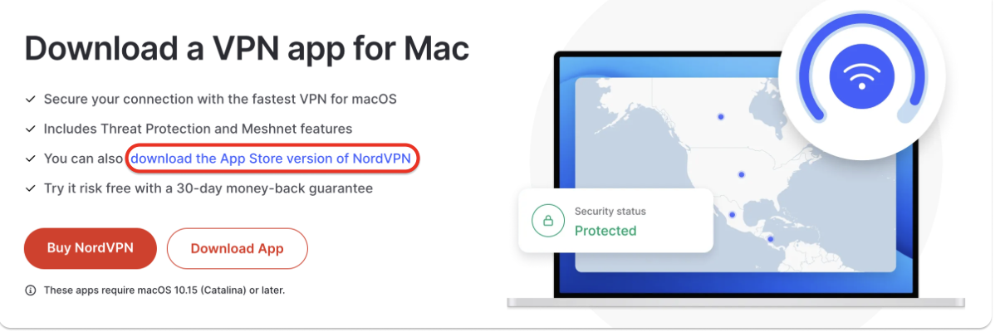
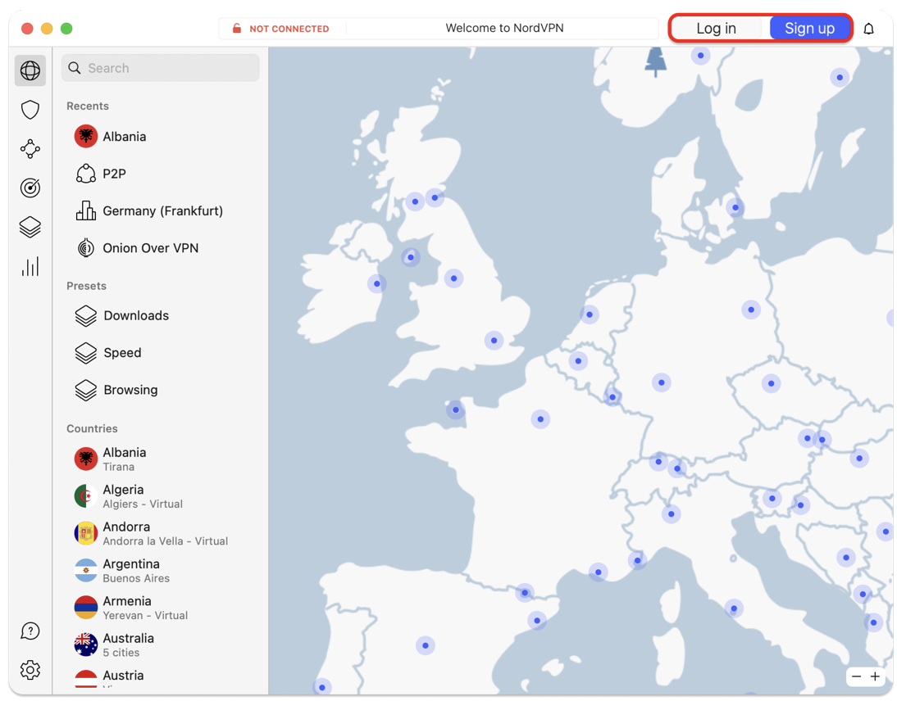
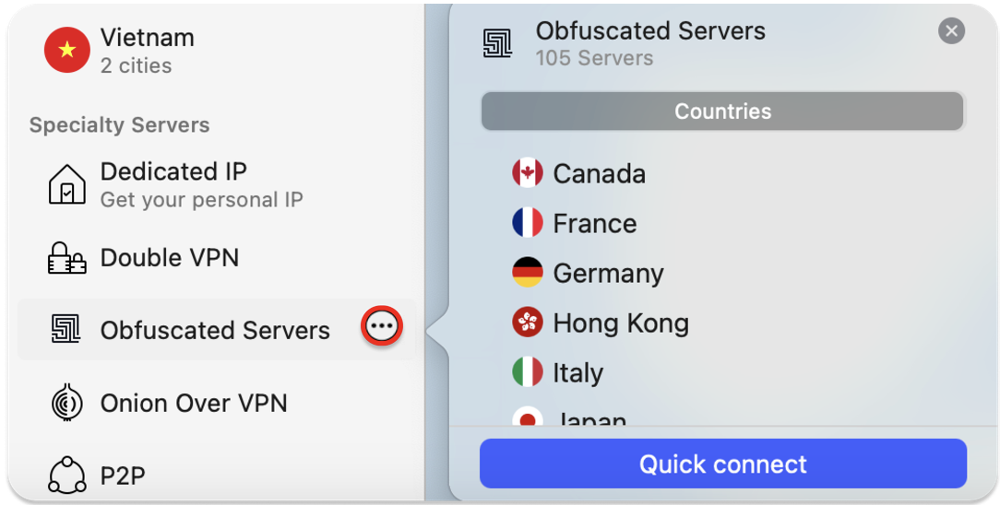
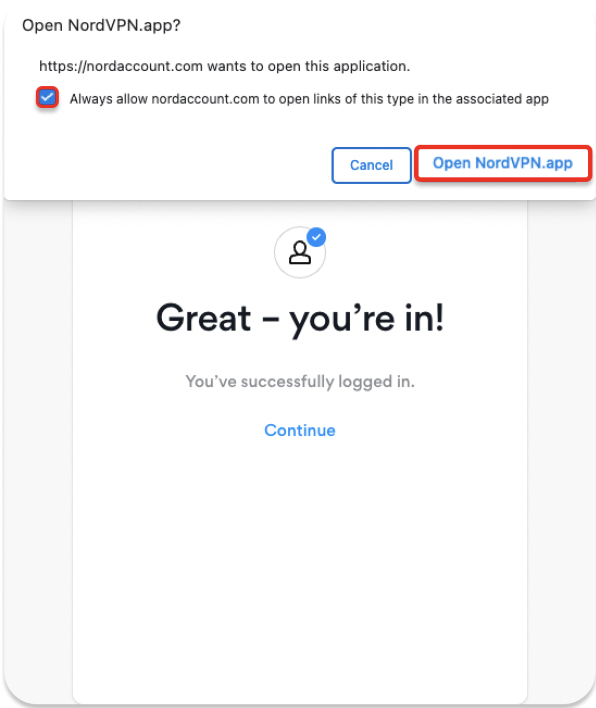

[Home](index.md) | [Manual Assessment Memo](manual_assessment_memo.md) | [Chatbot](chatbot.md) | [Procedure Video](procedure_video.md) | [Manual](manual.md) | [Reflective Blogs](reflective_blogs.md)

# Manual 

## **How to set up a secure remote work environment with Mac, NordVPN, and Dashlane**
  * For remote workers, freelancers, digital nomads, and anyone working from home!

This manual will help build a secure and resilient remote work environment. It walks through the key threats remote users face—like unsecured Wi-Fi, phishing, and weak passwords—and provides step-by-step instructions on how to protect personal and company data.

---

 Table of Contents:

1. [Why Security Matters When You Work Remotely](#1.-why-security-matters-when-you-work-remotely)
2. [Understanding the Threat Landscape](#.2-understanding-the-threat-landscape)
3. [How to Secure Your Devices](#3.-how-to-secure-your-devices)
4. [How to Secure Your Wi-Fi & Internet](#4.-how-to-secure-your-wi-fi-&-internet)
5. [How to Use a VPN and Why](#5.-how-to-use-a-vpn-and-why)
6. [How to Manage Passwords Like a Pro](#6.-how-to-manage-passwords-like-a-pro)
7. [Protecting Client & Company Data](#7.-protecting-client-&-company-data)
8. [Managing Work on Shared or Public Devices](#8.-managing-work-on-shared-or-public-devices)
9. [The Importance of Regular Backups](#9.-the-importance-of-regular-backups)
10. [Final Checklist for a Fort Knox-Level Setup](#10.-final-checklist-for-a-fort-knox-level-setup)
11. [Additional Tools and Resources](#11.-additional-tools-and-resources)
12. [Conclusion](#12.-conclusion)
13. [AI Tools Used](#13.-ai-tools-ssed)
14. [Works Cited](#14.-works-cited)
---

# 1. Why Security Matters When You Work Remotely

The freedom to work remotely—from your kitchen, a co-working space, or a favorite café—offers flexibility and independence. But without the protection of a company’s network or IT team, you’re more exposed to cybersecurity threats.

Public Wi-Fi, unsecured devices, and weak passwords can quickly lead to data breaches, identity theft, or the loss of sensitive client information.

This manual is your step-by-step guide to securing your remote work setup. Whether you’re a freelancer, remote employee, or just checking email on the go, you’ll learn how to:
* Identify digital threats
* Secure your devices and internet connection
* Protect sensitive data and communication
* Set up reliable backup systems

# 2. Understanding the Threat Landscape

In the constant evolving world of technology there are online threats everywhere. This section will help clarify you on some of the most frequent risks and easy ways to avoid falling for them. 

Common Digital Threats for Remote Workers:

- Public Wi-Fi Risks (Man-in-the-Middle Attacks)
What Happens: Hackers can intercept your data on public Wi-Fi—like at coffee shops or airports—and steal things like passwords and payment info.

Protect Yourself: 
* Avoid public Wi-Fi for sensitive tasks (banking, work emails).
* Use a VPN to encrypt your internet connection.
---

  <strong>Figure 1:</strong> A hacker secretly intercepts communication between a device and a network in a Man-in-the-Middle (MitM) attack. Captured from 
  <a href="https://www.thesslstore.com/blog/man-in-the-middle-attack-2/" target="_blank" style="color: gray;">The SSL Store</a>.

- Phishing Attacks
What Happens: Scammers send fake emails or messages pretending to be trusted sources to trick you into clicking harmful links or sharing private info.

Protect Yourself:
* Check the sender’s email before opening messages.
* Don’t click links in emails—go directly to the site.
* Enable Multi-Factor Authentication (MFA) for extra account protection.

---

  <strong>Figure 2:</strong> How the Phishing Attack Works. Captured from 
  <a href="https://learning.mlytics.com/cyber-attacks/what-is-a-phishing-attack/" target="_blank" style="color: gray;">mlytics Learning Center</a>.

- Infected USB Devices
What Happens: Plugging in a USB drive can install hidden malware that steals files or infects your system without you knowing.

Protect Yourself:
* Only use trusted USBs.
* Scan USBs with antivirus software.
* Turn off auto-run so malware doesn’t launch automatically.

---

  <strong>Figure 3:</strong> What an infected USB port can do if infected and how it exports phone data to the hacker. Captured from 
  <a href="https://nordlayer.com/blog/juice-jacking-the-hidden-cyber-threat/" target="_blank" style="color: gray;">NordLayer</a>.

- Outdated Software (Unpatched Vulnerabilities)
What Happens: Hackers target old software with known flaws to access your device and data.

Protect Yourself:
* Update your OS, apps, and browser regularly.
* Turn on automatic updates.
* Use trusted software that gets regular security patches.

---

  <strong>Figure 4:</strong> In Mac settings where to make sure updates are automatic. Captured from 
  <a href="https://osxdaily.com/2019/04/11/enable-auto-update-macos-system-software/" style="color: gray;">OSXDaily</a>.

---

# 3. How to Secure Your Devices

Now that you know some of the most common attacks that can happen to your system let's dive deeper into how to secure your device by downloading NordVPN for Mac users.

What is NordVPN: A virtual private network (VPN) service that encrypts your internet traffic, masks your IP address, and allows you to connect to servers in different locations, providing enhanced online privacy and security.

Why is it important: It enhances online privacy and security by encrypting internet traffic, masking your IP address, and offering a no-logs policy. It also helps bypass geoblocks, providing access to geo-restricted content. Additionally, NordVPN includes features like Threat Protection and Dark Web Monitor to safeguard against online threats and potential data breaches. 

How to install:

1. Download and Install the App
* Open the App Store on your Mac.
* In the search bar, type "NordVPN" and find the official app.
* Click "Get" and then "Install" to download it.
* Once installed, launch the app from Launchpad or Applications.

  <strong>Figure 5:</strong> What the NordVPN app looks like in app store. Captured from 
  <a href="https://support.nordvpn.com/hc/en-us/articles/20492395403921-Installing-NordVPN-App-Store-version-on-macOS#h_01HG8K02E90YXZNW46H7GR9JXE" style="color: gray;">NordVPN</a>.

2. Log In or Sign Up
* When the app opens, click “Log In” if you already have a NordVPN account.
* If you don’t have an account, click “Sign Up” to create one.
* You’ll be redirected to a browser window to complete the login process securely.
* After logging in, return to the app to continue setup.

  <strong>Figure 6:</strong> You can Log In or Sign Up in the top-right corner of the screen. Captured from 
  <a href="https://support.nordvpn.com/hc/en-us/articles/20492395403921-Installing-NordVPN-App-Store-version-on-macOS#h_01HG8K02E90YXZNW46H7GR9JXE" style="color: gray;">NordVPN</a>.

3. Grant Permissions
* The app may ask for permissions to add VPN configurations to your device.
* Click "Allow" when prompted.
* You may also need to enter your Mac’s admin password to authorize changes.

  <strong>Figure 7:</strong> To connect to a specialty server, hover over one of the categories under Specialty Servers, and click on the three-dot menu to select a Country. Captured from 
  <a href="https://support.nordvpn.com/hc/en-us/articles/20492395403921-Installing-NordVPN-App-Store-version-on-macOS#h_01HG8K02E90YXZNW46H7GR9JXE" style="color: gray;">NordVPN</a>.

4. Connect to NordVPN
* To connect quickly, click “Quick Connect”—this chooses the fastest available server based on your location.
* To select a specific country or server type (like Double VPN or P2P), click the search bar or browse the server list.

  <strong>Figure 8:</strong> After completing the above steps, you will be prompted to open the NordVPN app. Agree always to allow Nord Account and grant access to the app. Captured from 
  <a href="https://support.nordvpn.com/hc/en-us/articles/20492395403921-Installing-NordVPN-App-Store-version-on-macOS#h_01HG8K02E90YXZNW46H7GR9JXE" style="color: gray;">NordVPN</a>.

5. Optional: Adjust App Settings
* Open the Settings panel to:
* Enable Auto-connect on startup.
* Choose a preferred VPN protocol (e.g., NordLynx or OpenVPN).
* Manage notifications and kill switch options.

Congrats you just secured your NordVPN! This will ensure you have a safe connection in the outside world. It's important to not stop here though. Continue to follow along to learn how you can make sure you keep a secure working environment.

# 4. How to Secure Your Wi-Fi & Internet

Change Default Router Password
Why it’s important: Many routers come with a default username and password (like “admin” for both). These defaults are widely known and can easily be found by attackers. If you leave your router using these default settings, it’s like leaving the front door wide open for anyone to walk in.

How to Change Your Router Password:

Log into Your Router:
Open a browser and enter your router's IP address in the address bar (usually 192.168.1.1 or 192.168.0.1).
Enter the default login credentials (you can find these on the bottom of the router or in the manual; common defaults are “admin” for both username and password).
Navigate to the Admin Settings:
Once logged in, look for an option like System Settings, Administration, or Security in the menu.
Change the Password:
Find the option to change your admin password. Create a strong, unique password that is difficult to guess. Use a mix of upper and lowercase letters, numbers, and special characters.
Tip: A good password is at least 12 characters long and does not include easily guessable information (e.g., “password123” or “admin”).
Save and Log Out:
After changing the password, be sure to save the settings, then log out of the router interface.
Important: Don’t forget the new password—you’ll need it to access your router settings in the future.
* Use WPA3 or WPA2 Encryption
Why it’s important: WPA2 (Wi-Fi Protected Access 2) and WPA3 are the encryption protocols that secure the communication between your router and connected devices. Using outdated encryption like WEP (Wired Equivalent Privacy) leaves your Wi-Fi network vulnerable to hacking, as WEP can be easily cracked.

How to Enable WPA3 or WPA2 Encryption:

Log into Your Router Settings:
Just like in the previous step, enter your router’s IP address into a browser to access the settings.
Locate the Wireless Settings:
Find the Wireless Settings or Wi-Fi Settings section. It may also be under Network Settings or Security Settings.
Check the Encryption Protocol:
Look for the encryption option, usually listed under Security Type or Encryption Mode.
Select WPA3 if available. If your router doesn’t support WPA3, WPA2 is still secure enough for most use cases.
Avoid using WEP or WPA, as they are outdated and insecure.
Save Settings and Reboot:
After selecting WPA3 or WPA2, save the settings. Your router may automatically reboot, or you might need to reboot it manually to apply the changes.
Update Your Devices:
If you switch to WPA3, ensure your devices (smartphones, laptops, etc.) support it. Older devices may not be able to connect with WPA3 encryption.
*Disable Remote Access
Why it’s important: Remote access allows you to connect to your router’s administrative interface from outside your home network. While this feature can be useful, it can also open up your router to attacks, as hackers may attempt to access your router remotely.

How to Disable Remote Access:

Log into Your Router’s Admin Page:
Use the same steps as before to access your router’s settings via the web browser.
Find the Remote Access Settings:
Look for an option related to Remote Management, Remote Access, or Web Access. This is usually in the Administration or Advanced Settings sections.
Disable Remote Access:
Disable the option to allow remote access. This ensures that only devices connected to your local network can log into your router’s settings.
Tip: Some routers allow you to specify certain IP addresses that can access the router remotely. If you need remote access but still want to secure it, only allow trusted IP addresses and use a VPN.
Save the Settings and Log Out:
After disabling remote access, save your settings. You’ll likely be logged out automatically, so log back in with your new admin password to make sure the changes took effect.
Reboot the Router (if necessary):
Some routers may require a reboot to finalize changes to remote access settings.

# 5. How to Use a VPN and Why

Why You Need a VPN (and What It Does)
1. Hides Your IP Address:
   
Why it’s important: Your IP address reveals your physical location and identity online. When you connect to the internet without a VPN, websites and services can see your IP address, which can be used to track your online behavior or even access your private information. By hiding your IP address, a VPN helps protect your privacy.

2. Encrypts Your Traffic:

Why it’s important: VPNs use encryption to secure the data traveling between your device and the internet. This means that even if someone intercepts your internet traffic, they won’t be able to read it. This is especially important when you’re using public Wi-Fi networks (like at coffee shops or airports), which are often unsecured and easy targets for hackers.

3. Protects on Public Networks:

Why it’s important: Public Wi-Fi networks are inherently risky because they don’t require passwords or strong security measures. Cybercriminals often lurk on public Wi-Fi to intercept data or perform attacks. A VPN helps secure your connection on these networks by encrypting your traffic and hiding your IP address, making it much harder for attackers to snoop on you.

How to Use a VPN

1. Choose a VPN Provider:
Why it’s important: Not all VPNs are created equal, so it’s crucial to choose a reliable and trusted provider. Some popular options include:

NordVPN: Known for its fast speeds and strong security features.
ProtonVPN: A good choice for privacy-focused individuals, offering strong encryption and a no-logs policy.
ExpressVPN: Provides easy-to-use apps and fast servers worldwide.
How to choose: Look for features like no-logs policies, strong encryption, server locations near your region, and high speed for minimal disruption in your internet usage.

2. Install the VPN App:
Why it’s important: Installing the app makes it easy to activate the VPN on your device. Most VPN services offer user-friendly apps for Windows, macOS, Android, iOS, and even browser extensions. Installing the app ensures that you can securely connect to the internet at any time.

How to install:
* Download the app from the official website or app store for your device.
* Run the installation wizard, follow the prompts, and sign up or log into your VPN account.
* Complete the setup, which may include setting preferences like which VPN server to connect to and whether to automatically connect on startup.
* Log In and Connect Before Starting Work:

How to connect:
* Open the VPN app and log in with your account credentials.
* Choose a server based on your needs. For example, you might choose a server in your home country for a local IP address or in a different country for greater anonymity.
* Click Connect to establish the VPN connection. Once connected, your internet traffic will be encrypted, and your IP address will be masked.

* Additional VPN Tips:
Use Split Tunneling (if needed): Some VPN services offer a split tunneling feature that allows you to route some traffic through the VPN while leaving other traffic unaffected. This can help improve speed if you’re only concerned about securing specific apps or websites.
Always Use a Kill Switch: Many VPNs include a kill switch feature, which automatically disconnects your internet if the VPN connection drops. This ensures that your data is never transmitted without encryption.
Stay Connected to a VPN: If your VPN app allows it, you can set it to automatically connect when your device starts. This adds an extra layer of security, ensuring that you’re always protected, even if you forget to manually connect to the VPN.

# 6. How to Manage Passwords Like a Pro

Use a Password Manager
What it is:

A password manager is like a digital safe for your passwords. It securely stores all your login information (for websites, apps, etc.) in one place.

Why you need it:

Instead of trying to remember complex passwords for all your accounts (which is almost impossible), a password manager will do the hard work for you. It generates strong, unique passwords for every site and keeps them stored safely. This way, you only need to remember one master password to access everything else.

How it works:

* Store passwords: You can save your passwords for different accounts in the password manager.
* Generate strong passwords: It can create random, hard-to-crack passwords that are way stronger than what you’d come up with on your own.
* Autofill login info: It automatically fills in your login details when you visit websites, making it super easy and secure to log in.

Popular Password Managers:

- Dashlane
- Bitwarden
- 1Password
- Enable Two-Factor Authentication (2FA)

What it is:
Two-Factor Authentication (2FA) adds an extra layer of security to your accounts. Instead of just using your password, 2FA requires two forms of verification before you can log in: something you know (your password) and something you have (like your phone or an app).

Why you need it: Even if someone manages to steal your password, they still won’t be able to access your account because they would also need access to your second verification method (e.g., a code sent to your phone or an app). This makes it much harder for hackers to get into your accounts.

How it works: Enable 2FA on your accounts (you can usually find this option in the security settings).
When you log in, you'll enter your password as usual.
The service will then ask for a second factor—a code sent to your phone or generated by an authenticator app like Google Authenticator or Authy. You enter that code, and boom, you’re logged in! Even if someone steals your password, they can’t get in without that code.

Why not use SMS for 2FA? While SMS (text messages) used to be the go-to option for 2FA, it’s not as secure anymore. Hackers can sometimes intercept your texts. Instead, use an authenticator app like Google Authenticator or Authy. These apps generate codes that are more secure and not vulnerable to the same threats as SMS.

# 7. Protecting Client & Company Data

 Use Secure Cloud Services
What it is:
Cloud services like Google Workspace and Dropbox Business allow you to store your files online instead of on your computer. These platforms are built to be secure and offer features that protect your data.

Why you need it:
Storing sensitive files locally on your computer or device makes them vulnerable to theft, loss, or damage. By storing files in secure cloud services, you reduce the risk of data breaches or losing important information if your device is compromised.

How it works:

Google Workspace and Dropbox Business encrypt your files, so they are protected while stored online. You can access your files from anywhere and on any device, which makes it easier to work remotely. Cloud services offer automatic backups and sync, so your files are always up-to-date.

Why not just save files on your computer? Storing files locally on your device makes them more vulnerable to things like hacking, physical theft (if your computer gets stolen), or accidental deletion. Cloud services provide an added layer of security and access flexibility.

Avoid Saving Sensitive Files Locally

What it is: Sensitive files, like financial data, client records, and personal information, should not be saved on your computer’s hard drive or other local storage. Instead, save them in secure cloud services.

Why you need it: If you save important files locally and your device is compromised, hacked, or lost, those files are easily exposed. Cloud storage is more secure, provides encryption, and makes it easier to control access to sensitive data.

How it works: Keep sensitive files only in the cloud where they are encrypted and protected by strong security protocols.
If you must save something locally for offline access, make sure to encrypt it and use a password-protected folder.
Use Permissions (e.g., Read-Only Access Links)

What it is: When sharing files, cloud services let you control how others access them. For example, you can create links that only let others view files (read-only) instead of letting them edit or download them.

Why you need it: This gives you control over who can access your files and what they can do with them. If you don’t set the correct permissions, unauthorized people might be able to edit, delete, or download sensitive files.

How it works:
* Sharing Options: When sharing a file or folder in cloud services like Google Drive, you can choose options such as:
* View Only: The recipient can only view the file, not make changes.
* Comment Only: They can leave comments but can’t edit the content.
* Editor Access: They can make changes to the document.
* Link Sharing: When sharing links, you can select who has access and whether they can just view or also edit the file.

# 8. Managing Work on Shared or Public Devices

Use private/incognito mode
Always log out
Never save passwords on public browsers
Avoid using unknown USB drives

# 9. The Importance of Regular Backups**

Use the 3-2-1 Rule:

3 copies of your data
2 different storage types
1 copy off-site/cloud
Recommended tools: Backblaze, Carbonite, Google One

# 10. Final Checklist for a Fort Knox-Level Setup

* Antivirus installed & running
* VPN active
* Wi-Fi secured
* Password manager used
* 2FA enabled
* Data backed up
* No sensitive files stored locally

Additional Tools and Resources

Signal (Secure messaging)
ProtonMail (Encrypted email)
Have I Been Pwned (Check if your info is compromised)
EFF’s Surveillance Self-Defense (https://ssd.eff.org)

---
# 12. Conclusion

Securing your remote setup doesn’t have to be overwhelming. Start with the basics—VPN, passwords, antivirus—and build from there. With each step, you’re making it harder for intruders and easier to focus on doing great work from anywhere.

---
# 13. AI Tools Used

This manual was created using the following tools:

ChatGPT 4o (OpenAI, GPT-4) 

All content was enhanced with the above tool

---
# 14. Works Cited

NordVPN. (n.d.). What is a VPN? Retrieved from https://nordvpn.com

CISA. (2024). Remote Work Security Tips. https://www.cisa.gov

ProtonVPN. (n.d.). Secure Internet Guide. https://protonvpn.com

Dashlane. (n.d.). Password Manager Features. https://www.dashlane.com

Malwarebytes. (n.d.). Why Anti-Malware Matters. https://www.malwarebytes.com

EFF. (n.d.). Surveillance Self-Defense. https://ssd.eff.org

Have I Been Pwned. (n.d.). Data Breach Check. https://haveibeenpwned.com
