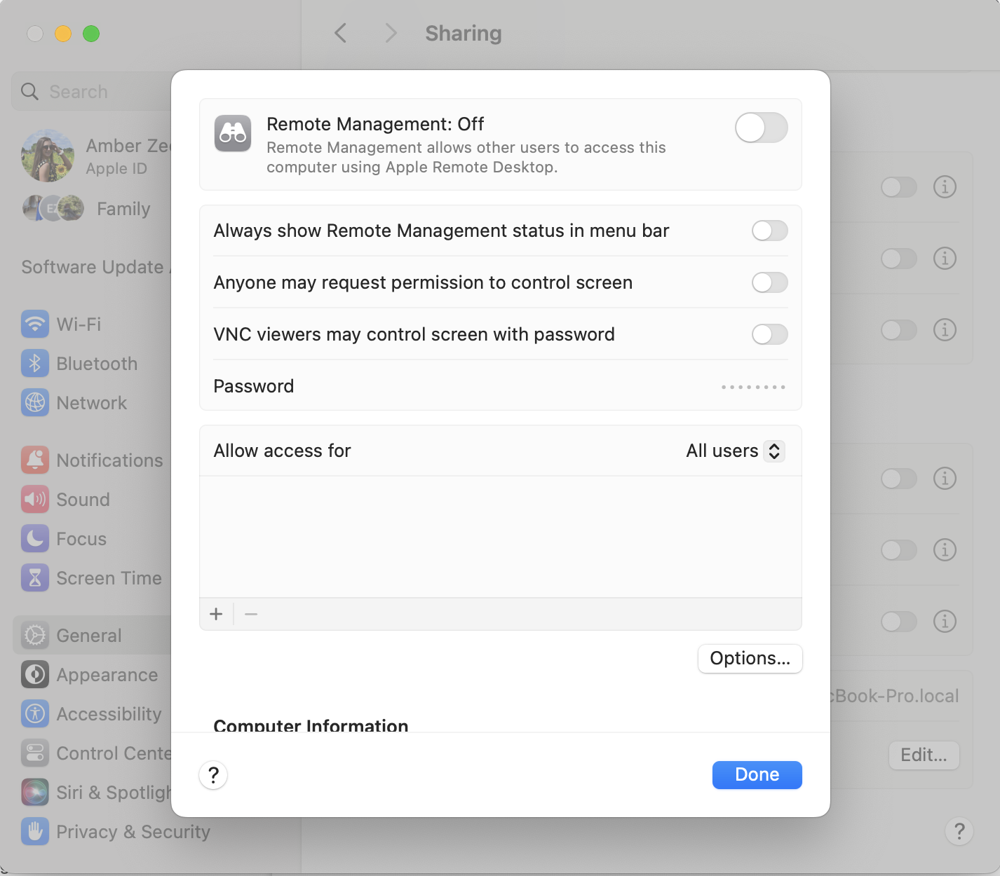

[Home](index.md) | [Manual Assessment Memo](manual_assessment_memo.md) | [Chatbot](chatbot.md) | [Procedure Video](procedure_video.md) | [Manual](manual.md) | [Reflective Blogs](reflective_blogs.md)

# Manual 

## **How to set up a secure remote work environment with MacOS using NordVPN and Dashlane**
  * For remote workers, freelancers, digital nomads, and anyone working from home!

This manual will help build a secure and resilient remote work environment. It walks through the key threats remote users face—like unsecured Wi-Fi, phishing, and weak passwords—and provides step-by-step instructions on how to protect personal and company data.

---

 Table of Contents:
 
1. [Why Security Matters When You Work Remotely](#why-security-matters-when-you-work-remotely)
2. [Understanding the Threat Landscape](#understanding-the-threat-landscape)
3. [How to Secure Your Devices](#how-to-secure-your-devices)
4. [How to Secure Your Wi-Fi & Internet](#how-to-secure-your-wi-fi-&-internet)
5. [How to Manage Passwords Like a Pro](#how-to-manage-passwords-like-a-pro)
6. [How to Use Dashlane on a MacOS](#how-to-use-dashlane-on-a-macos)
7. [Protecting Client & Company Data](#protecting-client-&-company-data)
8. [Managing Work on Shared or Public Devices](#managing-work-on-shared-or-public-devices)
9. [The Importance of Regular Backups](#the-importance-of-regular-backups)
10. [Final Checklist for a Fort Knox-Level Setup](#final-checklist-for-a-fort-knox-level-setup)
11. [Additional Tools and Resources](#additional-tools-and-resources)
12. [Conclusion](#conclusion)
13. [AI Tools Used](#ai-tools-ssed)
14. [Works Cited](#works-cited)

---

# Why Security Matters When You Work Remotely

The freedom to work remotely—from your kitchen, a co-working space, or a favorite café—offers flexibility and independence. But without the protection of a company’s network or IT team, you’re more exposed to cybersecurity threats.

Public Wi-Fi, unsecured devices, and weak passwords can quickly lead to data breaches, identity theft, or the loss of sensitive client information.

This manual is your step-by-step guide to securing your remote work setup. Whether you’re a freelancer, remote employee, or just checking email on the go, you’ll learn how to:
* Identify digital threats
* Secure your devices and internet connection
* Protect sensitive data and communication
* Set up reliable backup systems

# Understanding the Threat Landscape

In the constant evolving world of technology there are online threats everywhere. This section will help clarify you on some of the most frequent risks and easy ways to avoid falling for them. 

Common Digital Threats for Remote Workers:

**1) Public Wi-Fi Risks (Man-in-the-Middle Attacks)**

What Happens: Hackers can intercept your data on public Wi-Fi—like at coffee shops or airports—and steal things like passwords and payment info.

Protect Yourself: 
* Avoid public Wi-Fi for sensitive tasks (banking, work emails).
* Use a VPN to encrypt your internet connection.
---

  <strong>Figure 1:</strong> A hacker secretly intercepts communication between a device and a network in a Man-in-the-Middle (MitM) attack. Captured from 
  <a href="https://www.thesslstore.com/blog/man-in-the-middle-attack-2/" target="_blank" style="color: gray;">The SSL Store</a>.

**2) Phishing Attacks**

What Happens: Scammers send fake emails or messages pretending to be trusted sources to trick you into clicking harmful links or sharing private info.

Protect Yourself:
* Check the sender’s email before opening messages.
* Don’t click links in emails—go directly to the site.
* Enable Multi-Factor Authentication (MFA) for extra account protection.

---

  <strong>Figure 2:</strong> How the Phishing Attack Works. Captured from 
  <a href="https://learning.mlytics.com/cyber-attacks/what-is-a-phishing-attack/" target="_blank" style="color: gray;">mlytics Learning Center</a>.

**3) Infected USB Devices**

What Happens: Plugging in a USB drive can install hidden malware that steals files or infects your system without you knowing.

Protect Yourself:
* Only use trusted USBs.
* Scan USBs with antivirus software.
* Turn off auto-run so malware doesn’t launch automatically.

---

  <strong>Figure 3:</strong> What an infected USB port can do if infected and how it exports phone data to the hacker. Captured from 
  <a href="https://nordlayer.com/blog/juice-jacking-the-hidden-cyber-threat/" target="_blank" style="color: gray;">NordLayer</a>.

**4) Outdated Software (Unpatched Vulnerabilities)**

What Happens: Hackers target old software with known flaws to access your device and data.

Protect Yourself:
* Update your OS, apps, and browser regularly.
* Turn on automatic updates.
* Use trusted software that gets regular security patches.

---

  <strong>Figure 4:</strong> In Mac settings where to make sure updates are automatic. Captured from 
  <a href="https://osxdaily.com/2019/04/11/enable-auto-update-macos-system-software/" style="color: gray;">OSXDaily</a>.

---

# How to Secure Your Devices

Now that you know some of the most common attacks that can happen to your system let's dive deeper into how to secure your device by downloading NordVPN for MacOS users.

What is NordVPN: A virtual private network (VPN) service that encrypts your internet traffic, masks your IP address, and allows you to connect to servers in different locations, providing enhanced online privacy and security.

Why You Need a VPN (and What It Does):

**Hides Your IP Address:**
   
Why it’s important: Your IP address reveals your physical location and identity online. When you connect to the internet without a VPN, websites and services can see your IP address, which can be used to track your online behavior or even access your private information. By hiding your IP address, a VPN helps protect your privacy.

**Encrypts Your Traffic:**

Why it’s important: VPNs use encryption to secure the data traveling between your device and the internet. This means that even if someone intercepts your internet traffic, they won’t be able to read it. This is especially important when you’re using public Wi-Fi networks (like at coffee shops or airports), which are often unsecured and easy targets for hackers.

**Protects on Public Networks:**

Why it’s important: Public Wi-Fi networks are inherently risky because they don’t require passwords or strong security measures. Cybercriminals often lurk on public Wi-Fi to intercept data or perform attacks. A VPN helps secure your connection on these networks by encrypting your traffic and hiding your IP address, making it much harder for attackers to snoop on you.

How to install:

**1) Download and Install the App**
* Open the App Store on your Mac.
* In the search bar, type "NordVPN" and find the official app.
* Click "Get" and then "Install" to download it.
* Once installed, launch the app from Launchpad or Applications.

  <strong>Figure 5:</strong> What the NordVPN app looks like in app store. Captured from 
  <a href="https://support.nordvpn.com/hc/en-us/articles/20492395403921-Installing-NordVPN-App-Store-version-on-macOS#h_01HG8K02E90YXZNW46H7GR9JXE" style="color: gray;">NordVPN</a>.

**2) Log In or Sign Up**
* When the app opens, click “Log In” if you already have a NordVPN account.
* If you don’t have an account, click “Sign Up” to create one.
* You’ll be redirected to a browser window to complete the login process securely.
* After logging in, return to the app to continue setup.

  <strong>Figure 6:</strong> You can Log In or Sign Up in the top-right corner of the screen. Captured from 
  <a href="https://support.nordvpn.com/hc/en-us/articles/20492395403921-Installing-NordVPN-App-Store-version-on-macOS#h_01HG8K02E90YXZNW46H7GR9JXE" style="color: gray;">NordVPN</a>.

**3) Grant Permissions**
* The app may ask for permissions to add VPN configurations to your device.
* Click "Allow" when prompted.
* You may also need to enter your Mac’s admin password to authorize changes.

  <strong>Figure 7:</strong> To connect to a specialty server, hover over one of the categories under Specialty Servers, and click on the three-dot menu to select a Country. Captured from 
  <a href="https://support.nordvpn.com/hc/en-us/articles/20492395403921-Installing-NordVPN-App-Store-version-on-macOS#h_01HG8K02E90YXZNW46H7GR9JXE" style="color: gray;">NordVPN</a>.

**4) Connect to NordVPN**
* To connect quickly, click “Quick Connect”—this chooses the fastest available server based on your location.
* To select a specific country or server type (like Double VPN or P2P), click the search bar or browse the server list.

  <strong>Figure 8:</strong> After completing the above steps, you will be prompted to open the NordVPN app. Agree always to allow Nord Account and grant access to the app. Captured from 
  <a href="https://support.nordvpn.com/hc/en-us/articles/20492395403921-Installing-NordVPN-App-Store-version-on-macOS#h_01HG8K02E90YXZNW46H7GR9JXE" style="color: gray;">NordVPN</a>.

**5) Optional: Adjust App Settings**
* Open the Settings panel to:
* Enable Auto-connect on startup.
* Choose a preferred VPN protocol (e.g., NordLynx or OpenVPN).
* Manage notifications and kill switch options.

Congrats you just secured your NordVPN!

This will ensure you have a safe connection in the outside world. It's important to not stop here though. Continue to follow along to learn how you can make sure you keep a secure working environment.

# How to Secure Your Wi-Fi & Internet

Your router is the heart of your internet connection. It connects all your devices—phones, laptops, smart TVs—to the web. But if it’s not secured properly, hackers can easily sneak in, steal your data, or slow down your network. Thankfully, locking things down only takes a few steps.

Let’s walk through the top 3 ways to keep your home Wi-Fi safe.

**1) Change Your Router’s Default Login Info**

Why it matters: Most routers come with a factory-set username and password like admin for both fields. These are the same for every device of that model—and hackers know them. If you never change these, it’s like leaving your front door wide open.

How to change it:
* Access Your Router’s Settings
* Open a web browser and type your router’s IP address:
   * Usually 192.168.1.1 or 192.168.0.1
* Press Enter, and a login screen should appear.
* Use the default username and password (check the sticker on the router or the manual).

 

  <strong>Figure 9:</strong> Browser shown with the router IP typed in and the login screen visible on MacOS. Captured from 
  <a href="https://www.hellotech.com/guide/for/how-do-i-find-my-router-ip-address" style="color: gray;">HelloTech</a>.

 
**2) Go to the Admin or System Settings**
* Look for a tab or section called Administration, System Tools, or Security Settings.
* Change the Admin Password
* Create a new password that’s strong and unique.
* Use a mix of uppercase and lowercase letters, numbers, and symbols.
  * Example: WiFi4MyHouse!2024
  * Tip: Don’t use your name, address, or “password123.”
* Save Your Changes and Log Out

  <strong>Figure 10:</strong> What this page will look like on a MacOS. Captured from 
  <a href="https://www.cocosenor.com/articles/mac/how-to-change-mac-administrator-name-and-password.html" style="color: gray;">Cocosensor</a>.

*Mid check point: You’ve now locked the front door of your network!*

**3) Turn On Strong Encryption (WPA2 or WPA3)**

What is WPA2 OR WPA3: Modern routers use WPA2 or WPA3, which offer much better protection. WPA2 and WPA3 are like locks for your Wi-Fi. They protect your internet connection by scrambling your data so hackers can't see what you're doing. WPA2 is strong and widely used.
WPA3 is the newer, safer version with even better protection—especially on public Wi-Fi. Use WPA3 if your router and devices support it. If not, WPA2 is still safe.

Why it matters: Encryption scrambles your internet traffic so others can’t read it. If your router is using an outdated method like WEP for example, your network is vulnerable—even if it has a password.

How to check and change it:

1) Log in to your router settings (like before)
  
2) Open the Wireless or Wi-Fi Settings section
   
3) Look for something like Wireless Security, Encryption Type, or Network Security.
  
4) Choose WPA3 (if available), or WPA2
   *If you see WPA3, select it—it’s the newest and most secure.
   *If your router doesn’t support WPA3, WPA2 is still safe for most people.
   *Avoid using WEP or WPA—they’re outdated and easy to crack.

  <strong>Figure 11:</strong> Screenshot of encryption dropdown menu with WPA3 selected. Captured from 
  <a href="https://discussions.apple.com/thread/251670595?sortBy=rank" style="color: gray;">AppleSupport</a>.

* You may need to reconnect your devices using the same Wi-Fi password.
  * Older devices may not support WPA3—if that’s the case, stick with WPA2.*

**4) Disable Remote Access to Your Router**

Why it matters: Remote access lets you log into your router’s settings from anywhere on the internet. While that might sound convenient, it’s a major security risk if left on. Hackers can use this to try logging in and taking control of your network.

How to turn it off:
* Log into the router’s settings again
* Look for Remote Access or Remote Management
* This is usually under Advanced Settings, Security, or Administration.
* Turn off Remote Access
* Uncheck or toggle off the setting that allows access from outside your home network.

  <strong>Figure 12:</strong> Remote access option turned off on MacOS system settings. Captured from 
  <a  style="color: gray;">Amber Zeqo</a>.

*Some routers may require a restart for changes to take effect.*

# How to Manage Passwords Like a Pro

Now that we have discussed how to secure your network and VPN it is time to dive deeper into the importance of passwords. A password manager is like a super smart digital safe that holds all your usernames and passwords in one protected spot. Instead of trying to remember dozens of different logins, you only need to remember one strong master password—the password manager takes care of the rest.

**Why You Should Use One**

Let’s face it—trying to create and remember a strong, unique password for every single website or app is really hard. That’s why many people end up using the same password everywhere, or choosing ones that are easy to guess (like "abc123" or their pet’s name).

But that’s risky—if a hacker gets into one of your accounts, they could easily break into all the others that use the same password.

That’s where a password manager comes in to save the day:

* It keeps you safer online
  *Each of your accounts gets a unique, strong password, so if one site is hacked, your other accounts are still safe.
* It saves time
  * No more typing out passwords or struggling to remember what you used. The manager can fill in your login info for you automatically.
* It creates strong passwords for you
  * Password managers can instantly generate random, complex passwords that are super hard to guess—way better than anything we could come up with ourselves.
* It works across your devices
  * Whether you’re on your laptop, phone, or tablet, your saved passwords are available when you need them.
* You can store more than just passwords
  * Many password managers also let you save credit card info, notes, Wi-Fi logins, and even copies of important documents—all encrypted and secure.
  
* Common Features You’ll Find:
  * Password vault – A locked area where all your logins are stored.
  * Autofill – Automatically fills in usernames and passwords when you visit a site or open an app.
  * Password generator – Suggests strong, unique passwords when creating new accounts.
  * Security alerts – Warns you if one of your saved accounts is part of a known data breach.
  * Two-factor support – Some managers can even help manage your 2FA codes.

Popular and Trusted Options:

* Dashlane
* Bitwarden
* 1Password
* NordPass

# How to Use Dashlane on a MacOS

This manual will teach you about the password manager: Dashlane! 

What is it? 

Dashlane is a password manager and digital wallet application that helps users securely store, manage, and access their digital identities, including passwords, payments, and personal information. 

Why Dashlane? 

Dashlane uses the strongest encryption available and a zero-knowledge architecture, which means that only you have access to your data. Your logins and personal information are always “encrypted,” even when we store your data on our servers. Encryption scrambles your data so no one can read it.

Let's get started to help continue to secure your remote workspace!

**1) Download Dashlane**

   * Go to www.dashlane.com and click on the “Get Dashlane” button.
   * Choose the option to download for Mac.
   * Once the file downloads, open it and follow the instructions to install the app on your computer.

  <strong>Figure 13:</strong> Screenshot of the Dashlane homepage showing the Welcome page. Captured from 
  <a href="https://support.dashlane.com/hc/en-us/articles/115005432325-Get-started-with-the-Dashlane-web-app-and-extension" style="color: gray;">DashLane Support</a>.

**2) Create Your Dashlane Account**

     * Open the Dashlane app after it installs.
     * Click “Create Account.
     * Enter your email address and choose a strong master password—this is the only password you’ll ever need to remember, so make it good!
     * Use a mix of uppercase letters, lowercase letters, numbers, and special symbols.
     * Make it something memorable to you, but hard for others to guess.
*Tip: Dashlane will let you know if your master password is strong enough.* 

  <strong>Figure 14:</strong> The “Create Account” screen with the fields for email and master password. Captured from 
  <a href="https://www.comparitech.com/password-managers/reviews/dashlane-review/" style="color: gray;">Comparitech</a>.

**3) Save Your First Password**

     * Once your account is created, Dashlane will ask if you want to import existing passwords (from your browser) or manually add a new one.
     * Try adding a password manually first:
     * Click “+ Add new item” or go to the Passwords tab.
     * Enter the website, your username, and your password.
     * Click Save.
         * This is great for adding things like your email, banking, or social media logins right away.

  <strong>Figure 16:</strong> A way to organize your logins and secure notes with collections. Captured from 
  <a href="https://support.dashlane.com/hc/en-us/articles/12131325346578-Organize-your-logins-and-Secure-Notes-with-Collections" style="color: gray;">DashLane Support</a>.

**4) Install the Dashlane Browser Extension**
     * Dashlane works best when it’s added to your browser (like Safari, Chrome, or Firefox).
     * After setting up your account, it will suggest installing the browser extension.
     * Follow the on-screen instructions to add it.
        * This lets Dashlane autofill your passwords automatically when you visit websites.

  <strong>Figure 16:</strong> Dashlane icon in the browser bar or the installation page for the extension. Captured from 
  <a href="https://support.dashlane.com/hc/en-us/articles/115005432325-Get-started-with-the-Dashlane-web-app-and-extension" style="color: gray;">DashLane Support</a>.

**5) Let Dashlane Do the Work**

Now that everything is set up, you don’t have to worry about remembering passwords anymore.

    * When you visit a login page, Dashlane will offer to fill in your username and password.
    * When you create a new account somewhere, Dashlane will offer to generate a strong password for you.
    * You can also access your vault at any time by opening the Dashlane app.

  <strong>Figure 17:</strong> Dashlane automatically filling in a login form on a website. Captured from 
  <a href="https://www.dashlane.com/personal-password-manager/autofill" style="color: gray;">DashLane</a>.

# Protecting Client & Company Data

 Use Secure Cloud Services
What it is:
Cloud services like Google Workspace and Dropbox Business allow you to store your files online instead of on your computer. These platforms are built to be secure and offer features that protect your data.

Why you need it:
Storing sensitive files locally on your computer or device makes them vulnerable to theft, loss, or damage. By storing files in secure cloud services, you reduce the risk of data breaches or losing important information if your device is compromised.

How it works:

Google Workspace and Dropbox Business encrypt your files, so they are protected while stored online. You can access your files from anywhere and on any device, which makes it easier to work remotely. Cloud services offer automatic backups and sync, so your files are always up-to-date.

Why not just save files on your computer? Storing files locally on your device makes them more vulnerable to things like hacking, physical theft (if your computer gets stolen), or accidental deletion. Cloud services provide an added layer of security and access flexibility.

Avoid Saving Sensitive Files Locally

What it is: Sensitive files, like financial data, client records, and personal information, should not be saved on your computer’s hard drive or other local storage. Instead, save them in secure cloud services.

Why you need it: If you save important files locally and your device is compromised, hacked, or lost, those files are easily exposed. Cloud storage is more secure, provides encryption, and makes it easier to control access to sensitive data.

How it works: Keep sensitive files only in the cloud where they are encrypted and protected by strong security protocols.
If you must save something locally for offline access, make sure to encrypt it and use a password-protected folder.
Use Permissions (e.g., Read-Only Access Links)

What it is: When sharing files, cloud services let you control how others access them. For example, you can create links that only let others view files (read-only) instead of letting them edit or download them.

Why you need it: This gives you control over who can access your files and what they can do with them. If you don’t set the correct permissions, unauthorized people might be able to edit, delete, or download sensitive files.

How it works:
* Sharing Options: When sharing a file or folder in cloud services like Google Drive, you can choose options such as:
* View Only: The recipient can only view the file, not make changes.
* Comment Only: They can leave comments but can’t edit the content.
* Editor Access: They can make changes to the document.
* Link Sharing: When sharing links, you can select who has access and whether they can just view or also edit the file.

# Managing Work on Shared or Public Devices

Use private/incognito mode
Always log out
Never save passwords on public browsers
Avoid using unknown USB drives

# The Importance of Regular Backups**

Use the 3-2-1 Rule:

3 copies of your data
2 different storage types
1 copy off-site/cloud
Recommended tools: Backblaze, Carbonite, Google One

# Final Checklist for a Fort Knox-Level Setup

* Antivirus installed & running
* VPN active
* Wi-Fi secured
* Password manager used
* 2FA enabled
* Data backed up
* No sensitive files stored locally

Additional Tools and Resources

Signal (Secure messaging)
ProtonMail (Encrypted email)
Have I Been Pwned (Check if your info is compromised)
EFF’s Surveillance Self-Defense (https://ssd.eff.org)

---
# Conclusion

Securing your remote setup doesn’t have to be overwhelming. Start with the basics—VPN, passwords, antivirus—and build from there. With each step, you’re making it harder for intruders and easier to focus on doing great work from anywhere.

---
# AI Tools Used

This manual was created using the following tools:

ChatGPT 4o (OpenAI, GPT-4) 

All content was enhanced with the above tool

---
# Works Cited

NordVPN. (n.d.). What is a VPN? Retrieved from https://nordvpn.com

CISA. (2024). Remote Work Security Tips. https://www.cisa.gov

ProtonVPN. (n.d.). Secure Internet Guide. https://protonvpn.com

Dashlane. (n.d.). Password Manager Features. https://www.dashlane.com

Malwarebytes. (n.d.). Why Anti-Malware Matters. https://www.malwarebytes.com

EFF. (n.d.). Surveillance Self-Defense. https://ssd.eff.org

Have I Been Pwned. (n.d.). Data Breach Check. https://haveibeenpwned.com
